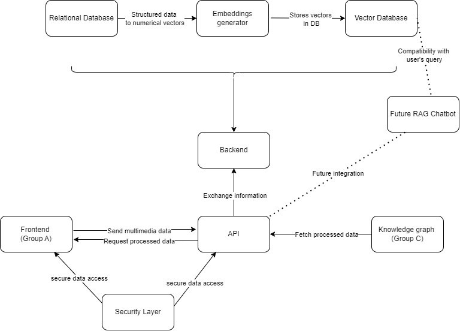

# Backend API for Multimedia Data Processing

This repository contains the Backend API used to process and store multimedia data (images (.png), audio (.mp3), text (.doc), ...), and provide endpoints for frontend data display and knowledge graph integration.

## Project Structure

### Teams
1. *Frontend (Group A):
Create a user friendly interface that captures data (images, text, audio) from client maintenance workers.

2. **Application Programming Interface (API) (Group B1):
Creates connections between the rest of the teams by providing endpoints for data retrieval and interaction with the knowledge graph.
   
3. **Backend (Group B2):
A central hub for processing and storing multimedia data.

4. **Knowledge Graph (Group C):
Fetches processed data from the backend API, organizes and represents it in a knowledge graph.

5. **Chatbot (RAG):
A future integration for querying stored data for generating responses.

### Application Programming Interface (API)
### Endpoints

#### Frontend Endpoints

1. **POST /images*
   - Upload an image to the backend for processing and storage.
   - *Request Body: Image data.
   - **Response: Confirmation of image storage.

2. **POST /audio*
   - Upload an audio file to be processed into text.
   - *Request Body: Audio data.
   - **Response: Confirmation of text storage.
   
3. **POST /text*
   - Upload an text file to be processed and stored.
   - *Request Body: Text data.
   - **Response: Confirmation of text storage.

#### Knowledge Graph Endpoints

1. **GET /images*
   - Retrieve a list of stored images from the knowledge graph.
   - *Response: JSON array of images with metadata.

2. **GET /images/{id}*
   - Retrieve details of a specific image by ID from the knowledge graph.
   - *Response: JSON object with image details.

3. **GET /processed-data*
   - Retrieve structured data (processed images, audio, text) for integration into the knowledge graph.
   - *Response: Processed data in JSON format.

#### Chatbot Endpoints

1. **GET /data/search* (Future Chatbot Integration)
   - Allows searching for data to be used by the RAG chatbot for response generation.

### Backend 

This project is divided into several components, each focusing on a specific part of the backend processing pipeline:

1. *Relational Database*
Stores raw data inputs, including text, speech-to-text transcriptions, and images collected by the operators.

2. *Embeddings Generation*
Processes the raw data to create embeddings for each piece of information. This step is essential for enabling efficient search and retrieval of relevant data.

3. *Vector Database*
Holds the generated embeddings, providing a fast and effective way for the chatbot to retrieve data.

4. *RAG Chatbot*
Uses the embeddings to provide contextually relevant answers to operators and managers based on natural language queries.

## Objectives

- *Develop Backend Architecture* 
Build a robust backend capable of handling multimedia data storage and processing.

- *Integrate with RAG Chatbot*
Prepare the backend for integration with a retrieval-augmented generation chatbot, enabling efficient data retrieval.

- *Support Knowledge Graph Compatibility*
Ensure the backend’s data structure is compatible with a knowledge graph, allowing structured and interconnected data retrieval.

- Ensure connection with knowledge graph in terms of data types, etc.

## Deliverables

- *Prototype Backend System*
A functional backend system that can process and store text, speech-to-text, and images.

- *Technical Report*
A detailed documentation of the backend architecture, scalability strategies, and processing workflow.

- *Demo*
A demonstration using example data to showcase the backend's ability to process and store data for retrieval.

### Authentication

The API is secured using token-based authentication (JWT) which ensures that each team is provided with proper tokens for accessing specific resources.

### How to Run the API

1. Clone this repository:
    bash
    cd your-repository-directory
    git clone https://github.com/your_username/multimedia_backend.git
    

2. Install dependencies:
    bash
    pip install -r requirements.txt
    

### Tasks & Issues

Please check the GitHub project board for ongoing tasks, issues, and updates.

### Security Considerations

- Use HTTPS for all communications between the frontend, backend, and knowledge graph.
- Token-based authentication is implemented for secure access to the API.
- Ensure compliance with security and privacy standards.

---

## Diagram

---

For further queries or improvements, please reach out to the backend team.
